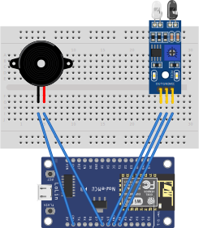

# [door-monitor-esp8266](https://cri.dev/posts/2020-09-03-DIY-IoT-door-monitor-with-ESP8266/)



See [Fritzing file](./Gatekeeper.fzz) for circuit overview

[Related blog post](https://cri.dev/posts/2020-09-03-DIY-IoT-door-monitor-with-ESP8266/)

```
  HTTP GET /
    -> replies with the client html
  HTTP GET /door
    -> returns the status of the door, whether it's "open" or "closed"
  HTTP GET /alarm
    -> returns the status of the alarm, whether it's "on" or "off"
  HTTP POST /toggle-alarm
    -> toggles the alarm and returns the current status of it
  HTTP POST /setup
    -> to save the Wi-Fi credentials and connect to the desired access point
```

The Web UI give you the current status of the door.

It also features a form where you can input the Wi-Fi credentials to connect to your home network.

This means that once the door monitor is connected to Wi-Fi, it's accessible via the hostname `gatekeeper`.

E.g. with my FritzBox setup, it's available under `gatekeeper.fritz.box:80`

Read more about it [here](https://cri.dev/posts/2020-09-03-DIY-IoT-door-monitor-with-ESP8266/)
